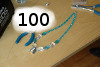

Dynamic Image
===

JavaScript library to enable dynamic resolution change and delayed load until image is in browser view port. The change of image resolution is based on `` element width change.

A usage scenario is to only load scaled down versions of large photos on devices with small screens, to save time and bandwidth. Another usage scenario is to delay the loading of images until visible in browser view port.

For a small width area a small image is loaded, such as e.g. 100 pixels wide version:

For a wider area a larger image is loaded, such as e.g. 300 pixels wide version:

See file [example_usage.htm](example_usage.htm) for example usage. See source file [dynamicImage.js](dynamicImage.js) for further details.